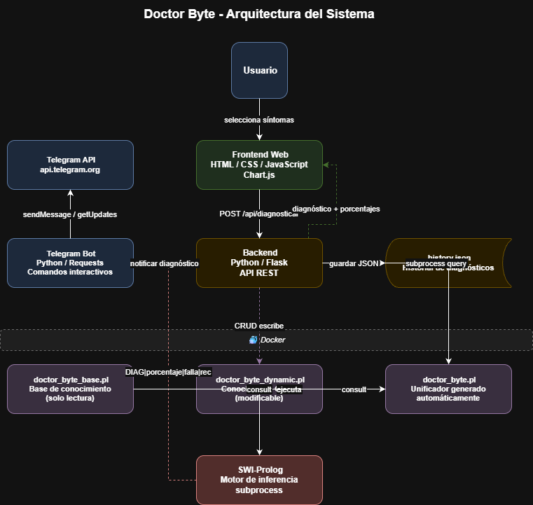

# Doctor Byte - Documento Técnico
## Inteligencia Artificial 1 - USAC 2026

**Estudiante:** Pablo Alejandro Marroquin Cutz  
**Carnet:** 202200214  
**Fecha:** Junio 2026  

---

## 1. Descripción General

Doctor Byte es un sistema experto orientado al diagnóstico de fallas comunes en computadoras. El sistema permite que un usuario seleccione síntomas relacionados con el comportamiento de un equipo y reciba un diagnóstico junto con recomendaciones para la posible solución del problema.

---

## 2. Arquitectura del Sistema

El sistema está compuesto por 4 componentes principales:

| Componente | Tecnología | Responsabilidad |
|---|---|---|
| Frontend | HTML, CSS, JavaScript | Interfaz de usuario |
| Backend | Python, Flask | API REST y lógica de negocio |
| Motor de inferencia | SWI-Prolog | Base de conocimiento y diagnóstico |
| Bot de Telegram | Python, Requests | Notificaciones automáticas |

---
### 2.1 Diagrama de Arquitectura


---

## 3. Estructura del Proyecto

```
FASE1/
├── prolog/
│   ├── doctor_byte_base.pl      # Base de conocimiento original
│   ├── doctor_byte_dynamic.pl   # Conocimiento agregado via CRUD
│   └── doctor_byte.pl           # Unificador generado automáticamente
├── backend/
│   ├── routes/
│   │   ├── diagnose.py          # Endpoints de diagnóstico
│   │   ├── history_routes.py    # Endpoints de historial
│   │   └── crud_routes.py       # Endpoints CRUD
│   ├── services/
│   │   ├── prolog_service.py    # Comunicación con SWI-Prolog
│   │   ├── prolog_crud_service.py # Gestión de archivos Prolog
│   │   └── telegram_service.py  # Envío de notificaciones
│   ├── models/
│   │   └── history.py           # Gestión del historial JSON
│   ├── app.py                   # Aplicación Flask principal
│   └── history.json             # Historial de diagnósticos
├── frontend/
│   ├── templates/
│   │   └── index.html           # Interfaz principal
│   └── static/
│       ├── css/style.css        # Estilos
│       └── js/app.js            # Lógica del frontend
├── telegram_bot/
│   └── bot.py                   # Bot de Telegram
├── docs/
│   ├── documento_tecnico.md     # Este documento
│   ├── manual_usuario.md        # Manual de usuario
│   └── arquitectura.drawio      # Diagrama de arquitectura
├── Dockerfile.backend
├── Dockerfile.bot
├── docker-compose.yml
└── .env
```

---

## 4. Base de Conocimiento Prolog

### 4.1 Estructura de archivos

El sistema utiliza 3 archivos Prolog:

- **doctor_byte_base.pl**: Contiene la base de conocimiento original con 15 síntomas, 10 fallas, 10 recomendaciones y las reglas de inferencia. Este archivo nunca se modifica directamente.
- **doctor_byte_dynamic.pl**: Almacena el conocimiento agregado dinámicamente mediante el CRUD. Es modificado por el backend.
- **doctor_byte.pl**: Archivo unificador generado automáticamente por el backend que combina los dos anteriores con las declaraciones `:- discontiguous`.

### 4.2 Síntomas implementados (15)

| ID | Nombre |
|---|---|
| pantalla_negra | Pantalla negra |
| pantalla_azul | Pantalla azul (BSOD) |
| no_enciende | El equipo no enciende |
| reinicio_inesperado | Reinicios inesperados |
| lentitud_extrema | Lentitud extrema |
| sobrecalentamiento | Sobrecalentamiento |
| ruido_disco | Ruido extraño en disco |
| no_detecta_disco | No detecta el disco duro |
| error_arranque | Error al arrancar |
| sin_imagen_monitor | Sin imagen en monitor |
| wifi_no_conecta | WiFi no conecta |
| puerto_usb_no_funciona | Puerto USB no funciona |
| bateria_no_carga | Batería no carga |
| pantalla_artefactos | Artefactos visuales en pantalla |
| memoria_insuficiente | Memoria insuficiente / errores de memoria |

### 4.3 Fallas diagnosticables (10)

| ID | Nombre |
|---|---|
| falla_ram | Falla en memoria RAM |
| falla_disco_duro | Falla en disco duro |
| falla_gpu | Falla en tarjeta gráfica (GPU) |
| sobrecalentamiento_cpu | Sobrecalentamiento de CPU |
| falla_fuente_poder | Falla en fuente de poder |
| falla_sistema_operativo | Falla en sistema operativo |
| falla_tarjeta_red | Falla en tarjeta de red |
| falla_controlador_usb | Falla en controlador USB |
| falla_monitor | Falla en monitor |
| falla_bateria | Falla en batería |

### 4.4 Reglas de inferencia

```prolog
% Regla principal de diagnóstico
diagnosticar(SintomasPaciente, Falla, NombreFalla, Porcentaje, Recomendacion) :-
    falla_sintoma(Falla, SintomasFalla),
    contar_coincidencias(SintomasFalla, SintomasPaciente, Coincidencias),
    Coincidencias > 0,
    length(SintomasFalla, Total),
    porcentaje(Coincidencias, Total, Porcentaje),
    recomendacion(Falla, Recomendacion),
    nombre_falla(Falla, NombreFalla).

% Uso del corte (!) para evitar backtracking innecesario
sintoma_valido(S) :- sintoma(S), !.
sintoma_valido(S) :- \+ sintoma(S), !, fail.

% Filtrado de síntomas válidos
filtrar_sintomas_validos([], []).
filtrar_sintomas_validos([S|Resto], [S|Validos]) :-
    sintoma(S), !,
    filtrar_sintomas_validos(Resto, Validos).
filtrar_sintomas_validos([_|Resto], Validos) :-
    filtrar_sintomas_validos(Resto, Validos).

% Obtener todos los diagnósticos ordenados por porcentaje
todos_diagnosticos(Sintomas, Diagnosticos) :-
    filtrar_sintomas_validos(Sintomas, SintomasValidos),
    findall(diag(P, F, N, R),
        diagnosticar(SintomasValidos, F, N, P, R),
        DiagnosticosRaw),
    msort(DiagnosticosRaw, Ordenados),
    reverse(Ordenados, Diagnosticos).
```

---

## 5. API REST

| Método | Endpoint | Descripción |
|---|---|---|
| GET | /api/health | Estado del servidor |
| GET | /api/sintomas | Listar todos los síntomas |
| POST | /api/diagnosticar | Realizar diagnóstico |
| GET | /api/historial | Obtener historial |
| DELETE | /api/historial | Limpiar historial |
| GET | /api/crud/sintomas | Listar síntomas dinámicos |
| POST | /api/crud/sintomas | Crear síntoma |
| DELETE | /api/crud/sintomas/{id} | Eliminar síntoma |
| GET | /api/crud/fallas | Listar fallas dinámicas |
| POST | /api/crud/fallas | Crear falla |
| PUT | /api/crud/fallas/{id} | Actualizar falla |
| DELETE | /api/crud/fallas/{id} | Eliminar falla |

---

## 6. Comunicación con Prolog

El backend se comunica con SWI-Prolog mediante `subprocess`, ejecutando consultas directamente y parseando el output con formato delimitado por pipes:

```python
def _run_query(query):
    goal = f"consult('{PL_PATH}'), {query}, halt."
    result = subprocess.run(
        [SWIPL_PATH, '-g', goal],
        capture_output=True,
        timeout=10,
        encoding='cp1252'
    )
    return result.stdout, result.stderr
```

---

## 7. Bot de Telegram

| Comando | Descripción |
|---|---|
| /start | Iniciar el bot y ver comandos disponibles |
| /diagnosticar | Iniciar sesión de diagnóstico interactivo |
| /sintomas | Ver síntomas disponibles |
| /historial | Ver últimos 5 diagnósticos |
| /listo | Finalizar selección de síntomas |
| /cancelar | Cancelar operación actual |

---

## 8. Docker

El sistema se containeriza en 2 servicios:

- **backend**: Ubuntu 22.04 + Python 3.10 + SWI-Prolog
- **telegram_bot**: Python 3.11 slim + Requests

```bash
# Levantar el sistema
docker compose up --build

# Detener el sistema
docker compose down
```

---

## 9. Tecnologías utilizadas

| Tecnología | Versión | Uso |
|---|---|---|
| SWI-Prolog | 10.0.2 | Motor de inferencia |
| Python | 3.11 | Backend y bot |
| Flask | 3.1.0 | Framework web |
| Flask-CORS | 5.0.0 | Manejo de CORS |
| Requests | 2.34.2 | HTTP client |
| Chart.js | 4.4.1 | Gráficas en frontend |
| Docker | 24+ | Containerización |
| Git | - | Control de versiones |
